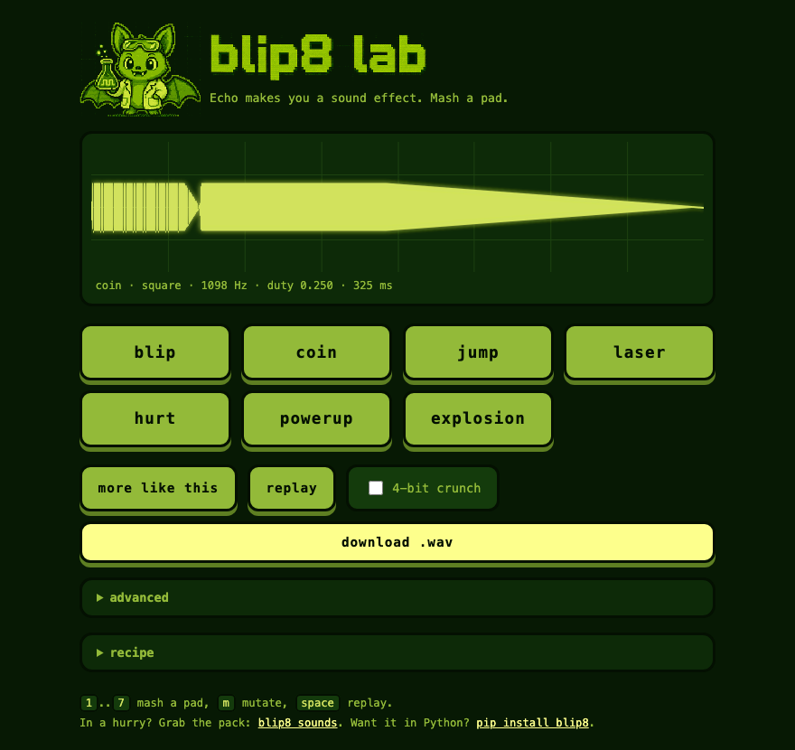

# blip8 lab

Make 8-bit sound effects in your browser: coins, jumps, lasers, explosions.
Mash a pad until you like what you hear, then download the .wav. No account, no
upload, no plugin. Every sound is arithmetic, generated in the tab.



The browser half of [blip8](https://github.com/sindriax/blip8), which is the
Python library underneath, and [blip8 sounds](https://sindriax.itch.io/blip8-sounds),
which is the ready made pack for people in a hurry.

## Run it

```sh
npm install
npm run dev
```

Mash a pad, or press <kbd>1</kbd> to <kbd>7</kbd>. <kbd>m</kbd> mutates the
current sound, <kbd>space</kbd> replays it.

## How it works

The whole app is a few hundred lines of vanilla TypeScript, no framework, so it
loads instantly inside an itch.io iframe.

**A sound is a `Params` object.** Flat, plain data: a category, a seed, a voice,
eight numbers and a crunch flag. Everything in the app is a function of it.

```
randomize(category, seed) -> Params -> render(Params) -> Float32Array
```

Those two halves stay apart on purpose. `randomize` holds all the taste (a jump
is a rising glide at a thin duty, a hurt is a falling one that lands on a bass
note) and `render` knows nothing about randomness, so the sliders can hand it
anything. The ranges come from the same recipes that generated the sound pack.

**Every number lands on its slider step.** That one rule buys three things: a
slider does not jump when you first touch it, the printed recipe is the sound
rather than a rounding of it, and a shared link stays short.

**`src/synth.ts` is a port of blip8's core** to WebAudio: square, triangle and
noise oscillators with accumulated phase for pitch glides, an ADSR envelope,
wavetables, 4 bit crunch, and 16 bit .wav export.

### Sounds are links

A sound straight off a pad is only ever a category and a seed, so its link says
exactly that. Once a knob moves, the roll no longer describes the sound, so the
link carries every number instead.

| Hash                            | Means                        |
| ------------------------------- | ---------------------------- |
| `#coin.481920371`               | the coin that seed rolls     |
| `#coin.481920371!`              | the same one, 4 bit crunched |
| `#laser.5~sine~f1800_g0.14_...` | a laser somebody edited      |

Unparseable hashes are ignored, out of range numbers are clamped rather than
refused, so a hand edited link still makes a sound.

### The recipe view is checked, not claimed

The lab prints the blip8 call for whatever you are hearing, so you can install
the library and render the same sound from Python. That is only worth anything
if it is true, so it is a test rather than a promise: `tests/port-fidelity.test.ts`
renders each sound in TypeScript, runs the printed recipe through the real
blip8, and diffs the samples.

```sh
npm test
```

Agreement is within one int16 step, which is the resolution of a .wav file.
Writing that test found three real divergences in the port: the glide
interpolation and the envelope ramps were each off by one sample, because
numpy's `linspace` includes its endpoint, and `crunch` rounded ties up where
numpy rounds them to even.

Noise is the one exception, and the recipe says so in a comment. blip8 draws
from numpy's PCG64 and the lab from mulberry32, so the same seed gives the same
kind of noise, not the identical noise. The fidelity test skips noise for that
reason, and skips itself entirely if [uv](https://docs.astral.sh/uv/) is not
installed.

## Layout

```
index.html            structure only
src/sfx.ts            the engine: Params, randomize, mutate, render
src/synth.ts          the port of blip8's oscillators
src/scope.ts          the oscilloscope canvas
src/controls.ts       the advanced fold, generated from the limits table
src/link.ts           params in and out of the URL hash
src/recipe.ts         the current sound as a blip8 call
src/main.ts           wiring
scripts/covers.py     cover art, plotted from real blip8 samples
scripts/sprites.py    Echo and the wordmark, cut from the brand original
scripts/verify_recipes.py   the Python half of the fidelity test
```

## Development

```sh
npm run dev          # vite dev server
npm test             # vitest, including the port fidelity check
npm run typecheck    # tsc, no emit
npm run build        # typecheck then build to dist/
npm run format       # prettier
```

`dist/` is 84 KB of static files, images included. The same build uploads to
itch.io as an HTML5 tool and deploys to a static host.

## Art

Echo, the bat, is the label's mascot: bats emit blips for a living. The itch
covers are Echo art (originals live in
[blip8-sounds/brand](https://github.com/sindriax/blip8-sounds/tree/main/brand)).
The in-app sprites and the favicon are generated:

```sh
uv run ../blip8-sounds/brand/sprites.py lab --out public   # Echo and the wordmark
uv run scripts/covers.py                                   # waveform alternates, favicon
```

The sprite cropping lives with the art it crops, in
[blip8-sounds/brand](https://github.com/sindriax/blip8-sounds/tree/main/brand),
so the hub and the lab share one implementation. The output is committed, so a
build never needs that repo checked out.

## the blip8 family

- 🦇 [blip8](https://github.com/sindriax/blip8): the Python chiptune synthesis library. `pip install blip8`
- 🧪 [blip8 lab](https://sindriax.itch.io/blip8-lab): make 8-bit sounds in your browser ([source](https://github.com/sindriax/blip8-lab))
- 📦 [blip8 sounds](https://sindriax.itch.io/blip8-sounds): free CC0 chiptune SFX packs, generated from code ([source](https://github.com/sindriax/blip8-sounds))

## License

MIT, see [LICENSE](LICENSE). The sound pack is CC0 separately. Echo the bat
(the character art) is all rights reserved: use the code, not the mascot.
